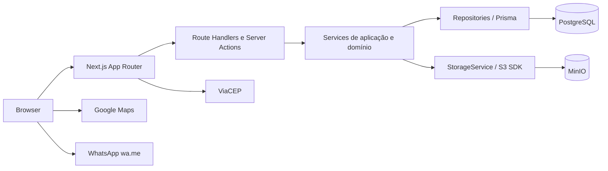
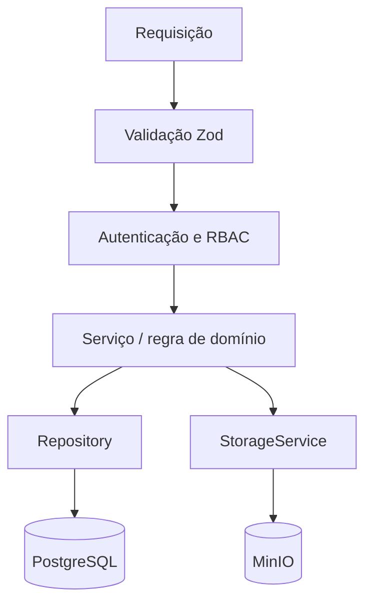

# Arquitetura e decisões

## Visão geral

UI em `src/app`, componentes reutilizáveis em `src/components`, casos de uso em `src/features`, serviços em `src/services`, acesso a dados em `src/repositories`, autenticação em `src/auth`, schemas Zod em `src/schemas`, integrações em `src/lib`. `prisma/schema.prisma`, migrations e seed em `prisma/`. Regras de publicação, autorização e imagens pertencem aos serviços e são reforçadas por constraints e consultas. Route Handlers atendem integrações e API; Server Actions podem atender formulários internos, sempre chamando os mesmos serviços.

## Decisões registradas

### DECISION-001 — ORM

Problema: persistência tipada e migrations. Opções: Prisma (ecosistema e ergonomia fortes, cliente gerado e migrations; maior custo de geração/runtime) ou Drizzle (SQL mais explícito e runtime menor; maior trabalho manual no modelo). Escolha: Prisma, conforme preferência original. Mudar exige atualizar banco, deploy e checklist antes do código.

### DECISION-002 — Publicação e upload

Problema: imóvel exige imagem, mas upload depende de ID. Escolha: criar rascunho técnico não público; subir objetos; registrar metadados; selecionar principal; publicar só após validação transacional da existência de imagem principal. MinIO e PostgreSQL não compartilham transação: falha no banco após upload aciona exclusão do objeto; limpeza que falhar vai para reconciliação operacional. Exclusão de imagem: atualizar banco e enfileirar/remover objeto; nunca deixar anúncio publicado sem principal.

### DECISION-003 — Exclusão e identificação

Excluir é soft delete. Código público é sequencial gerado atomicamente pelo banco e não reutilizado; slug inclui código e permanece estável após mudança de título para evitar links quebrados. Nome de tabela/sequence será definido em migration.

### DECISION-004 — Endereço público (decisão de produto pendente)

Pergunta: endereço e coordenadas exatos podem ser publicados? Padrão seguro do MVP: somente bairro/cidade/UF e mapa exato apenas com autorização explícita por imóvel. O campo futuro `showExactAddress` pode controlar publicação do endereço e coordenadas. Antes de implementar MAP-001, confirmar a política da imobiliária; a ausência de decisão não autoriza vazamento de coordenadas exatas em HTML, API, metadata ou WhatsApp.

### DECISION-005 — Tokens e sessão

JWT de acesso de 5 minutos; refresh opaco aleatório de 7 dias, com hash persistido e rotação. Essa escolha permite revogação e detecção de reutilização. Detalhes em [SECURITY.md](SECURITY.md).

### DECISION-006 — Google Maps

Usar API do Google Maps no cliente com chave restrita por domínio, carregamento sob demanda e mapa apenas quando coordenadas forem publicáveis. Geocoding automático é opcional e fica fora do MVP inicial. Custos, cotas e chave devem ser configurados no deploy.

## Convenções

Erros públicos seguem `API.md`; timestamps persistidos em UTC; UI em pt-BR; validação Zod compartilhada sem confiar nela como autorização. Imagens otimizadas por tamanho e carregamento. Health check verifica processo; readiness verifica PostgreSQL e MinIO quando necessário. Observabilidade inicial: logs estruturados sem segredos e métricas simples de erro/latência.
