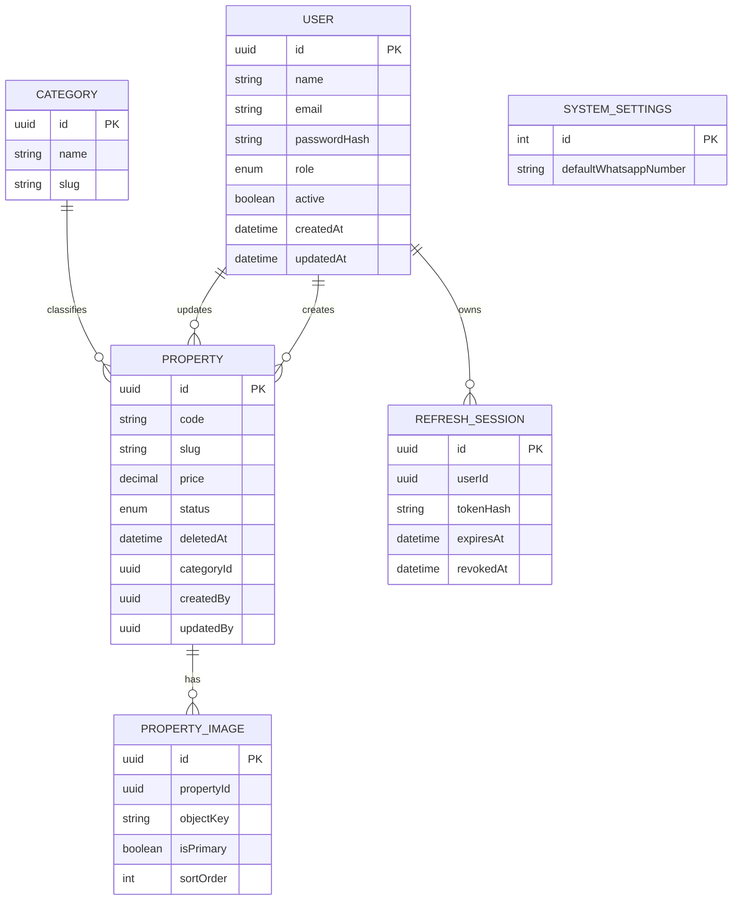

# Modelo de dados

Modelo implementado em `prisma/schema.prisma`. Migration inicial versionada em `prisma/migrations/20261006000000_init` e aplicada ao banco remoto em 06/10/2026; `prisma migrate status` confirmou sincronização. Usar `prisma migrate dev` apenas em banco local de desenvolvimento e `prisma migrate deploy` em ambientes remotos/produção. Não usar `db push` como estratégia de produção.

| Entidade | Campos e tipos principais | Regras |
|---|---|---|
| User | `id uuid`, `name varchar(160)`, `email citext/varchar(320)`, `passwordHash text`, `role enum ADMIN/USER`, `active boolean`, `createdAt/updatedAt timestamptz` | email único sem diferença de caixa; hash forte; não desativar último ADMIN ativo |
| Category | `id uuid`, `name varchar(80)`, `slug varchar(100)` | name/slug únicos; seed: Casa, Apartamento, Comércio, Galpão, Terreno |
| Property | `id uuid`, `code varchar(20)`, `slug varchar(240)`, `title varchar(200)`, `description text`, `price numeric(14,2)`, `status enum`, `categoryId uuid`, `zipCode char(8)`, `street`, `number`, `complement?`, `neighborhood`, `city`, `state char(2)`, `country` padrão Brasil, `latitude/longitude numeric?`, `whatsappNumber`, `publicationState DRAFT/PUBLISHED`, `createdBy/updatedBy uuid`, `createdAt/updatedAt/deletedAt timestamptz?` | preço > 0; code/slug únicos; status FOR_SALE/FOR_RENT/SOLD/RENTED; publicar requer imagem principal; lat -90..90, lon -180..180 |
| PropertyImage | `id uuid`, `propertyId uuid`, `objectKey text`, `bucket`, `originalFilename`, `mimeType`, `size bigint`, `isPrimary boolean`, `sortOrder int`, `createdAt timestamptz` | objectKey único por bucket; uma principal por imóvel via índice parcial; sortOrder não negativo |
| SystemSettings | `id int` fixo, `defaultWhatsappNumber varchar(20)`, `updatedAt`, `updatedBy uuid` | registro único; número internacional válido |
| RefreshSession | `id uuid`, `userId uuid`, `tokenHash text`, `familyId uuid`, `expiresAt`, `revokedAt?`, `createdAt`, `lastUsedAt?` | tokenHash único; nunca guardar token bruto |

Campos textuais de endereço devem receber limites concretos na migration. `createdBy` e `updatedBy` referenciam User com `ON DELETE RESTRICT`; usuários não são apagados fisicamente. Imagens usam `ON DELETE RESTRICT` no MVP por soft delete. `SystemSettings.updatedBy` opcional antes do bootstrap.

Índices: únicos em `User.email` normalizado, `Category.slug`, `Property.code`, `Property.slug`, `(bucket, objectKey)`, `RefreshSession.tokenHash`; parciais em `PropertyImage(propertyId) WHERE isPrimary`, `Property(status, createdAt DESC) WHERE deletedAt IS NULL AND publicationState='PUBLISHED'`, e compostos para categoria/cidade/bairro/preço conforme `EXPLAIN ANALYZE`. Índice em `Property(deletedAt, status, categoryId, city, neighborhood)` será avaliado por carga real. Busca textual inicial usa `ILIKE` com índices trigram quando volume justificar; código usa igualdade/prefixo.

Código público: sequence PostgreSQL dentro da transação de criação, formatado `IMO-` + 6 dígitos mínimos. Concorrência não gera duplicata; lacunas são aceitáveis. Mudança de título não altera slug. Ordenação de imagens é ajustada em transação; índice parcial garante principal única, serviço garante exatamente uma em imóvel publicado.

A migration criou `property_code_seq`, restrições de preço, latitude/longitude, CEP, tamanho/ordem de imagem, email em minúsculas e `SystemSettings.id = 1`, além de índice parcial para uma principal por imóvel. A regra de pelo menos uma imagem ao publicar envolve duas tabelas e será aplicada pelo serviço na Fase 15/19.

Seed idempotente de categorias e configurações. Primeiro ADMIN criado por CLI de bootstrap com email e senha informados no momento da execução, sem senha padrão nem segredo em Git. Migrations sempre antes do seed; backup antes de migrations de produção.
