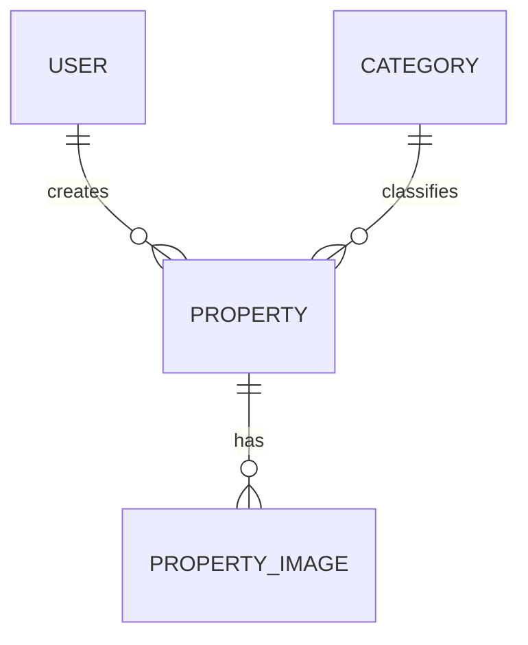

# PAPEL

Você atuará como **Arquiteto de Software Sênior, Product Engineer e Desenvolvedor Full Stack especialista em Next.js, PostgreSQL, Docker, MinIO e aplicações web modernas**.

Seu trabalho será projetar e posteriormente implementar uma **plataforma completa para uma imobiliária**, seguindo uma abordagem de **Spec Driven Development — SDD**.

Não comece simplesmente criando páginas e código.

Primeiro transforme todos os requisitos abaixo em uma especificação técnica clara, organizada, rastreável e implementável.

A especificação deverá ser utilizada como **fonte oficial da verdade do projeto**.

---

# 1. OBJETIVO DO PROJETO

Criar uma plataforma web para uma imobiliária divulgar imóveis para:

- venda;
- aluguel.

O sistema deverá possuir:

- área pública para visitantes;
- área administrativa protegida por autenticação;
- gerenciamento de imóveis;
- gerenciamento de usuários;
- múltiplas imagens por imóvel;
- integração com WhatsApp;
- consulta de CEP;
- mapa;
- filtros;
- busca;
- paginação;
- armazenamento de imagens através de MinIO/S3;
- deploy através de Docker no EasyPanel.

O sistema precisa ser totalmente responsivo para:

- desktop;
- tablet;
- celular.

---

# 2. METODOLOGIA OBRIGATÓRIA

Utilize **Spec Driven Development**.

Antes de implementar funcionalidades, crie a documentação do projeto.

Crie inicialmente:

```text
/docs
  SPEC-DRIVEN-DEVELOPMENT.md
  ARCHITECTURE.md
  DATABASE.md
  API.md
  SECURITY.md
  DEVELOPMENT-CHECKLIST.md
  DEPLOYMENT.md

README.md
.env.example
.gitignore
Dockerfile
docker-compose.yml
```

O arquivo principal será:

```text
docs/SPEC-DRIVEN-DEVELOPMENT.md
```

Ele deverá conter:

1. visão do produto;
2. objetivos;
3. escopo;
4. atores;
5. permissões;
6. funcionalidades;
7. regras de negócio;
8. entidades;
9. relacionamentos;
10. fluxos;
11. requisitos funcionais;
12. requisitos não funcionais;
13. critérios de aceite;
14. arquitetura;
15. segurança;
16. estratégia de armazenamento;
17. autenticação;
18. deploy;
19. testes;
20. roadmap de desenvolvimento.

---

# 3. REGRA PRINCIPAL DE DESENVOLVIMENTO

Não desenvolver funcionalidades aleatoriamente.

O projeto deverá ser dividido em fases.

Cada fase deverá possuir uma checklist.

Exemplo:

```text
[ ] Etapa não iniciada
[x] Etapa concluída
```

O Codex deverá atualizar `DEVELOPMENT-CHECKLIST.md` conforme o desenvolvimento avançar.

Nunca marcar uma tarefa como concluída se ela ainda não estiver funcional.

---

# 4. TECNOLOGIAS

Utilizar:

## Frontend

- Next.js;
- TypeScript;
- App Router;
- React;
- componentes reutilizáveis;
- abordagem responsiva/mobile-first.

Pode utilizar Tailwind CSS para estilização.

Pode utilizar biblioteca de componentes, desde que não prejudique a identidade visual personalizada.

## Backend

O próprio Next.js deverá fornecer o backend através de:

- Route Handlers;
- Server Actions quando apropriado;
- serviços;
- repositories;
- regras de domínio.

Não colocar regras importantes diretamente em componentes React.

Separar:

```text
UI
Application
Domain / Business Rules
Infrastructure
Database
```

Não é necessário aplicar DDD completo, mas preservar boa separação de responsabilidades.

---

# 5. BANCO DE DADOS

Utilizar:

```text
PostgreSQL
```

Utilizar ORM moderno compatível com Next.js.

Preferência inicial:

```text
Prisma ORM
```

Caso considere Drizzle ORM mais adequado, documente antes:

- vantagens;
- desvantagens;
- motivo da escolha.

Não altere a tecnologia silenciosamente.

Criar migrations versionadas.

Nunca utilizar:

```text
db push
```

como estratégia principal de produção.

Produção deve utilizar migrations.

---

# 6. ARMAZENAMENTO DE IMAGENS

Utilizar:

```text
MinIO
```

compatível com API S3.

O banco NÃO deverá armazenar o arquivo binário.

O PostgreSQL deverá armazenar somente informações referentes ao objeto, por exemplo:

```text
objectKey
bucket
mimeType
size
originalFilename
isPrimary
sortOrder
```

---

# 7. AUTENTICAÇÃO

Utilizar JWT.

O Access Token deverá possuir duração de:

```text
5 minutos
```

Como um access token de somente 5 minutos criaria uma experiência ruim caso o usuário precisasse realizar login novamente constantemente, implementar também:

```text
Refresh Token
```

Sugestão:

```text
Access Token: 5 minutos
Refresh Token: 7 dias
```

Explique essa decisão no documento de segurança.

Os tokens deverão ser tratados de maneira segura.

Preferir cookies:

```text
HttpOnly
Secure em produção
SameSite
```

Não armazenar token sensível no `localStorage`.

Implementar:

- login;
- logout;
- renovação do access token;
- verificação de usuário ativo;
- proteção de rotas;
- proteção também no backend;
- RBAC baseado em roles.

Nunca confiar somente na proteção do frontend.

---

# 8. USUÁRIOS DO SISTEMA

Existem três tipos de acesso.

## Visitante

Não precisa possuir conta.

Pode:

- acessar a home;
- pesquisar imóveis;
- utilizar filtros;
- paginar resultados;
- acessar detalhes dos imóveis;
- visualizar fotos;
- visualizar mapa;
- clicar no WhatsApp.

Não pode acessar nenhuma funcionalidade administrativa.

---

## Usuário comum

Possui login.

Pode:

- acessar painel administrativo;
- cadastrar imóveis;
- editar imóveis;
- excluir imóveis;
- marcar imóvel como vendido;
- marcar imóvel como alugado;
- gerenciar fotos.

Não pode:

- cadastrar usuários;
- editar usuários;
- desativar usuários;
- alterar permissões.

---

## Administrador

Possui todas as permissões do usuário comum.

Adicionalmente pode:

- cadastrar usuários;
- editar usuários;
- ativar usuário;
- desativar usuário;
- definir role;
- acessar configurações da imobiliária;
- definir número padrão de WhatsApp.

---

# 9. IMPORTANTE SOBRE PERMISSÕES DOS IMÓVEIS

Tanto ADMIN quanto USER podem:

```text
CREATE
READ
UPDATE
DELETE
```

imóveis.

Nesta primeira versão, um usuário comum NÃO está limitado aos imóveis cadastrados por ele.

Ou seja:

```text
USER pode editar imóveis cadastrados por outro USER.
```

Mesmo assim, armazenar:

```text
createdBy
updatedBy
createdAt
updatedAt
```

para auditoria futura.

---

# 10. ENTIDADE USER

Criar entidade de usuário contendo pelo menos:

```text
id
name
email
passwordHash
role
active
createdAt
updatedAt
```

Roles:

```text
ADMIN
USER
```

Regras:

- email único;
- senha nunca armazenada em texto puro;
- senha utilizando hash seguro;
- usuário desativado não poderá autenticar;
- somente ADMIN poderá criar ou alterar usuários.

---

# 11. ENTIDADE PROPERTY / IMÓVEL

Cada imóvel deverá possuir um identificador interno UUID.

Também criar um código amigável para atendimento.

Exemplo:

```text
IMO-000001
IMO-000002
```

Esse código será extremamente útil para:

- busca;
- atendimento;
- WhatsApp;
- identificação do anúncio.

Campos esperados:

```text
id
code
title
description
price

status

categoryId

zipCode
street
number
complement
neighborhood
city
state
country

latitude
longitude

whatsappNumber

createdBy
updatedBy

createdAt
updatedAt
deletedAt
```

Avaliar outros campos estritamente necessários e documentar antes de criar.

---

# 12. STATUS DOS IMÓVEIS

O imóvel terá quatro estados principais:

```text
FOR_SALE
FOR_RENT
SOLD
RENTED
```

Representando:

```text
À venda
Para aluguel
Vendido
Alugado
```

Somente imóveis:

```text
FOR_SALE
FOR_RENT
```

podem aparecer nas páginas públicas.

Imóveis:

```text
SOLD
RENTED
```

continuam armazenados no sistema administrativo, porém não aparecem na listagem pública.

Isso deve ser garantido também no backend.

Nunca depender apenas do frontend para ocultá-los.

---

# 13. EXCLUSÃO DE IMÓVEIS

Preferir **Soft Delete**.

Adicionar:

```text
deletedAt
```

Quando um imóvel for excluído administrativamente:

```text
deletedAt != null
```

Ele não deverá aparecer:

- no site;
- nas consultas normais da administração.

Criar possibilidade futura de auditoria/restauração.

Documentar essa decisão.

---

# 14. CATEGORIAS

Categorias iniciais:

```text
Casa
Apartamento
Comércio
Galpão
Terreno
```

Criar entidade:

```text
Category
```

Inicialmente fazer seed dessas categorias.

Nesta primeira versão NÃO é necessário CRUD de categorias.

Estruturar o banco para permitir essa funcionalidade futuramente.

---

# 15. ENTIDADE PROPERTY IMAGE

Um imóvel pode possuir várias imagens.

Criar entidade semelhante a:

```text
PropertyImage

id
propertyId
objectKey
bucket
originalFilename
mimeType
size
isPrimary
sortOrder
createdAt
```

Regras obrigatórias:

- imóvel precisa possuir ao menos uma imagem para ser publicado;
- somente uma imagem deverá ser marcada como principal;
- deve ser possível selecionar imagem principal;
- deve ser possível excluir imagem;
- deve ser possível alterar a ordem das imagens;
- a imagem principal será utilizada nos cards;
- detalhes do imóvel terão carrossel.

Preparar o sistema para limitar formatos.

Aceitar inicialmente:

```text
JPEG
PNG
WEBP
```

Bloquear tipos de arquivos potencialmente perigosos.

Criar limite configurável para tamanho do arquivo.

Sugestão inicial:

```text
10 MB por imagem
```

---

# 16. CONFIGURAÇÕES DA IMOBILIÁRIA

Criar uma área de:

```text
Administração > Configurações
```

Somente ADMIN poderá acessá-la.

Criar pelo menos:

```text
defaultWhatsappNumber
```

Pode criar entidade:

```text
SystemSettings
```

ou solução equivalente.

O número será usado como padrão ao cadastrar novos imóveis.

---

# 17. REGRA DO WHATSAPP

Essa regra é importante.

Existe um número padrão configurado pelo administrador.

Ao criar um novo imóvel:

```text
property.whatsappNumber = defaultWhatsappNumber
```

Entretanto, o usuário que estiver cadastrando poderá alterar esse número especificamente para aquele imóvel.

Portanto:

```text
SystemSettings.defaultWhatsappNumber
```

é apenas o valor padrão.

Cada imóvel mantém seu próprio:

```text
whatsappNumber
```

Alterar posteriormente o número padrão NÃO deverá obrigatoriamente modificar imóveis existentes.

---

# 18. BOTÃO DO WHATSAPP

Cada página de imóvel deverá possuir CTA destacado:

```text
Tenho interesse
Falar pelo WhatsApp
```

Utilizar link no formato:

```text
https://wa.me/NUMERO?text=MENSAGEM
```

A mensagem deverá ser automaticamente preenchida.

Exemplo:

```text
Olá! Tenho interesse neste imóvel.

Código: IMO-000123
Imóvel: Casa com 3 dormitórios
Finalidade: Venda
Valor: R$ 450.000,00

Endereço:
Rua ...
Bairro ...
Cidade - UF

Link do imóvel:
https://dominio.com.br/imoveis/...

Gostaria de mais informações.
```

Fazer `URL Encode` corretamente da mensagem.

Nunca concatenar texto sem tratamento.

---

# 19. ENDEREÇO

O imóvel deve possuir endereço completo:

```text
CEP
Logradouro
Número
Complemento
Bairro
Cidade
Estado
País
Latitude
Longitude
```

País padrão:

```text
Brasil
```

---

# 20. CONSULTA POR CEP

No formulário do imóvel haverá campo CEP.

Ao preencher um CEP válido, consultar serviço de CEP.

Pode utilizar inicialmente:

```text
ViaCEP
```

Preencher automaticamente:

```text
logradouro
bairro
cidade
estado
```

O usuário deve poder corrigir ou alterar manualmente qualquer informação retornada.

Implementar:

- loading;
- CEP inválido;
- CEP inexistente;
- erro de conexão;
- tratamento de timeout.

Nunca travar o formulário caso a API de CEP esteja indisponível.

---

# 21. LATITUDE E LONGITUDE

O imóvel deverá possuir:

```text
latitude
longitude
```

Permitir preenchimento manual.

Opcionalmente implementar botão:

```text
Buscar coordenadas pelo endereço
```

utilizando serviço de Geocoding do Google.

Caso implemente isso, separar corretamente a API Key através das variáveis de ambiente.

---

# 22. MAPA

Na página pública de detalhes do imóvel mostrar um mapa utilizando Google Maps.

Utilizar:

```text
latitude
longitude
```

do imóvel.

Não carregar mapa caso o imóvel não possua coordenadas.

Criar fallback amigável.

---

# 23. OBSERVAÇÃO DE PRIVACIDADE SOBRE ENDEREÇO

Criar na documentação uma observação importante:

Exibir endereço exato publicamente pode não ser desejável em determinados imóveis.

Portanto, arquitetar o sistema para futuramente permitir:

```text
mostrar endereço completo
ou
mostrar somente região aproximada
```

Não precisa necessariamente implementar essa configuração no primeiro MVP, mas deixar documentada.

---

# 24. HOME

A home deverá ter identidade visual de imobiliária moderna.

Cores predominantes:

```text
verde claro
branco
```

Utilizar:

- bastante espaço;
- tipografia legível;
- cards modernos;
- bordas suaves;
- sombras discretas;
- visual profissional;
- interface limpa.

Evitar aparência genérica de dashboard administrativo na área pública.

---

# 25. HOME — CONTEÚDO

A página inicial deverá possuir pelo menos:

```text
Header
Logo/nome da imobiliária
Busca
Filtros principais
Imóveis disponíveis
Cards dos imóveis
Paginação ou acesso à listagem
CTA WhatsApp quando adequado
Footer
```

Separar visualmente:

```text
Imóveis para venda
Imóveis para aluguel
```

caso faça sentido para experiência do usuário.

---

# 26. CARD DE IMÓVEL

Um card deverá apresentar pelo menos:

```text
imagem principal
categoria
status Venda/Aluguel
título
bairro
cidade
valor
código do imóvel
```

Ao clicar:

```text
/imoveis/[slug]
```

ou estrutura equivalente.

---

# 27. SLUG

Criar URL amigável.

Exemplo:

```text
/imoveis/casa-3-quartos-jardim-europa-imo-000123
```

Garantir unicidade.

O código do imóvel poderá participar do slug.

---

# 28. LISTAGEM PÚBLICA

Criar rota:

```text
/imoveis
```

A listagem deverá permitir:

### Busca

Buscar pelo menos por:

```text
código do imóvel
título
cidade
bairro
```

### Filtros

Obrigatórios:

```text
Venda / Aluguel
Categoria
Cidade
Bairro/região
```

Recomendados:

```text
Preço mínimo
Preço máximo
```

### Ordenação

Adicionar:

```text
Mais recentes
Menor preço
Maior preço
```

---

# 29. FILTROS NA URL

Sempre que possível guardar filtros através de Query String.

Exemplo:

```text
/imoveis?status=FOR_SALE&city=SaoPaulo&category=Casa&page=2
```

Isso permite:

- compartilhar busca;
- voltar no navegador;
- melhor experiência;
- URLs indexáveis;
- persistência natural do filtro.

---

# 30. PAGINAÇÃO

Realizar paginação no servidor.

Não carregar todos os imóveis e paginar somente no frontend.

Definir valor padrão.

Sugestão:

```text
12 imóveis por página
```

A API deve retornar algo semelhante a:

```json
{
  "data": [],
  "pagination": {
    "page": 1,
    "pageSize": 12,
    "total": 120,
    "totalPages": 10
  }
}
```

---

# 31. DETALHES DO IMÓVEL

Página:

```text
/imoveis/[slug]
```

Mostrar:

```text
carrossel de fotos
imagem principal
código do imóvel
título
descrição
valor
categoria
Venda ou Aluguel
endereço/região
mapa
botão WhatsApp
```

Criar experiência mobile adequada.

O botão WhatsApp deve ficar facilmente acessível no celular.

Avaliar CTA sticky em mobile.

---

# 32. LOGIN

Criar:

```text
/login
```

Campos:

```text
email
senha
```

Implementar:

- validação;
- loading;
- erro de credenciais;
- usuário desativado;
- logout;
- proteção contra mensagens que revelem informações sensíveis.

---

# 33. ÁREA ADMINISTRATIVA

Estrutura sugerida:

```text
/admin

/admin/imoveis

/admin/imoveis/novo

/admin/imoveis/[id]/editar

/admin/usuarios

/admin/usuarios/novo

/admin/usuarios/[id]/editar

/admin/configuracoes
```

---

# 34. DASHBOARD

Criar dashboard simples mostrando informações como:

```text
Imóveis à venda
Imóveis para aluguel
Imóveis vendidos
Imóveis alugados
Total de imóveis
```

Não criar dashboards excessivamente complexos no primeiro MVP.

---

# 35. CRUD DE IMÓVEIS

Tela de consulta administrativa deverá possuir:

```text
busca
filtros
paginação
status
editar
excluir
```

Mostrar inclusive:

```text
FOR_SALE
FOR_RENT
SOLD
RENTED
```

Diferentemente da área pública.

---

# 36. CADASTRO DO IMÓVEL

Organizar formulário em seções.

Exemplo:

```text
Informações principais
Endereço
Localização/mapa
Fotos
Contato
```

Campos praticamente obrigatórios.

Obrigatórios inicialmente:

```text
Título
Descrição
Preço
Status
Categoria
CEP
Logradouro
Número
Bairro
Cidade
Estado
WhatsApp
Ao menos uma foto
Imagem principal
```

Complemento poderá ser opcional.

Latitude e longitude poderão ser opcionais inicialmente caso a geocodificação não consiga encontrá-las.

---

# 37. VALIDAÇÕES

Utilizar validação tanto:

```text
frontend
backend
```

Preferencialmente utilizar schemas compartilháveis com:

```text
Zod
```

Nunca confiar somente em validações HTML.

---

# 38. PREÇO

No banco utilizar tipo apropriado para moeda.

Nunca armazenar preço como:

```text
float
double
```

Utilizar:

```text
Decimal / Numeric
```

com precisão adequada.

Valores deverão ser exibidos em:

```text
pt-BR
BRL
```

Exemplo:

```text
R$ 450.000,00
```

---

# 39. UPLOAD DE IMAGENS

O fluxo deverá considerar:

1. usuário seleciona imagens;
2. sistema valida;
3. upload para MinIO;
4. salva referências no PostgreSQL;
5. usuário seleciona imagem principal;
6. sistema salva ordenação.

Não criar registros inválidos caso upload falhe.

Pensar em estratégia de compensação caso:

```text
upload tenha sido feito
mas banco falhe
```

ou:

```text
banco tenha sido salvo
mas upload falhe
```

Documentar a estratégia.

---

# 40. MINIO

Variáveis de ambiente esperadas:

```text
MINIO_ENDPOINT=
MINIO_PORT=
MINIO_ACCESS_KEY=
MINIO_SECRET_KEY=
MINIO_BUCKET=
MINIO_USE_SSL=
```

Nunca armazenar essas informações no código-fonte.

---

# 41. VARIÁVEIS DE AMBIENTE

Criar:

```text
.env.example
```

Nunca colocar credenciais reais nesse arquivo.

Criar localmente:

```text
.env.local
```

Exemplo de estrutura:

```text
DATABASE_URL=

JWT_SECRET=
JWT_REFRESH_SECRET=

MINIO_ENDPOINT=
MINIO_PORT=
MINIO_ACCESS_KEY=
MINIO_SECRET_KEY=
MINIO_BUCKET=
MINIO_USE_SSL=

GOOGLE_MAPS_API_KEY=
NEXT_PUBLIC_GOOGLE_MAPS_API_KEY=

NEXT_PUBLIC_APP_URL=

NODE_ENV=
```

Analise quais chaves realmente precisam ser públicas.

NÃO utilizar prefixo:

```text
NEXT_PUBLIC_
```

em segredo que deve permanecer no backend.

---

# 42. .GITIGNORE

Criar `.gitignore` completo para Next.js.

Obrigatoriamente ignorar:

```text
node_modules
.next
out
dist
coverage

.env
.env.local
.env.development.local
.env.test.local
.env.production.local

*.log

.DS_Store

.vscode
.idea

*.pem
```

Manter:

```text
.env.example
```

versionado.

Nunca versionar credenciais.

---

# 43. SEGURANÇA

Implementar e documentar:

```text
password hashing
authorization
authentication
HttpOnly cookies
Secure cookies
SameSite
CSRF quando aplicável
XSS
validação de entrada
SQL Injection
rate limiting
upload validation
MIME validation
file size limits
security headers
secrets management
```

Nunca confiar:

- role enviada pelo frontend;
- ID informado sem autorização;
- MIME informado somente pelo browser.

---

# 44. PROTEÇÃO CONTRA BRUTE FORCE

O endpoint de login deverá possuir proteção.

Implementar rate limiting.

Exemplo conceitual:

```text
5 tentativas em determinado intervalo
```

Não precisa necessariamente bloquear permanentemente a conta.

Documentar estratégia utilizada.

---

# 45. AUDITORIA BÁSICA

Armazenar:

```text
createdAt
updatedAt
createdBy
updatedBy
```

nos imóveis.

Estruturar código para futuramente permitir auditoria completa.

Não é obrigatório criar histórico de todas alterações no MVP.

---

# 46. SEO

Páginas públicas de imóveis deverão possuir:

```text
title
description
Open Graph
canonical URL quando adequado
```

Gerar metadata de maneira dinâmica.

Preparar estrutura para:

```text
sitemap.xml
robots.txt
```

Não indexar:

```text
/login
/admin/*
```

---

# 47. PERFORMANCE

O site deverá:

- usar imagens otimizadas;
- evitar carregar imagens em resolução gigante sem necessidade;
- utilizar paginação;
- evitar N+1 queries;
- usar índices adequados;
- usar queries server-side eficientes;
- utilizar lazy loading quando apropriado.

Criar índices no PostgreSQL para campos de busca frequente.

Analisar índices para:

```text
status
categoryId
city
neighborhood
createdAt
code
slug
deletedAt
```

---

# 48. RESPONSIVIDADE

Prioridade alta para smartphone.

Testar pelo menos:

```text
375px
768px
1024px
1440px
```

Nenhuma tela administrativa importante poderá ficar inutilizável no celular.

---

# 49. ACESSIBILIDADE

Implementar:

```text
labels
aria-label quando necessário
contraste adequado
navegação por teclado
alt em imagens
focus states
```

---

# 50. EMPTY STATES

Criar estados amigáveis para:

```text
Nenhum imóvel encontrado
Nenhuma imagem cadastrada
Nenhum usuário encontrado
Busca sem resultados
```

Nunca deixar apenas uma tela vazia.

---

# 51. LOADING E ERROS

Criar tratamento visual para:

```text
loading
erro
sucesso
empty state
```

Utilizar toast ou feedback apropriado.

Confirmação antes de ações destrutivas.

Exemplo:

```text
Deseja realmente excluir este imóvel?
```

---

# 52. DOCKER

A aplicação precisa rodar através de Docker.

Criar `Dockerfile` otimizado para produção.

Preferir:

```text
multi-stage build
```

Utilizar imagem Node adequada e pequena quando possível.

Configurar Next.js para:

```text
output: standalone
```

caso apropriado.

Não copiar arquivos desnecessários para a imagem final.

---

# 53. DOCKER COMPOSE LOCAL

Criar:

```text
docker-compose.yml
```

para ambiente local contendo:

```text
app
postgres
minio
```

Opcionalmente:

```text
minio-init
```

para criação automática do bucket.

Definir:

```text
healthcheck
volumes
networks
depends_on
```

adequadamente.

---

# 54. EASYPANEL

A aplicação será publicada através do:

```text
EasyPanel
```

Criar documentação:

```text
docs/DEPLOYMENT.md
```

Explicando:

1. build;
2. Dockerfile;
3. variáveis de ambiente;
4. PostgreSQL;
5. MinIO;
6. bucket;
7. migrations;
8. domínio;
9. HTTPS;
10. primeiro usuário administrador.

---

# 55. PRIMEIRO ADMINISTRADOR

Definir estratégia segura para criação inicial do administrador.

Pode ser:

```text
seed controlado por variáveis de ambiente
```

ou:

```text
CLI/script de bootstrap
```

NÃO criar:

```text
admin@admin.com
admin123
```

automaticamente em produção.

Documentar a solução.

---

# 56. ARQUITETURA DE PASTAS

Propor uma arquitetura organizada.

Exemplo conceitual:

```text
src/
  app/
  components/
  features/
  services/
  repositories/
  lib/
  auth/
  schemas/
  types/
  utils/

prisma/
  schema.prisma
  migrations/
  seed.ts

docs/

public/
```

Não transformar o projeto em arquitetura excessivamente complexa.

A estrutura deve favorecer manutenção.

---

# 57. SERVICES

Regras de negócio não deverão ficar espalhadas nos endpoints.

Exemplo:

```text
PropertyService
UserService
AuthService
StorageService
SettingsService
CepService
GeocodingService
```

---

# 58. REPOSITORIES

Separar acesso ao banco das regras quando isso melhorar a manutenção.

Exemplo:

```text
PropertyRepository
UserRepository
SettingsRepository
```

Não criar abstrações inúteis.

Evitar overengineering.

---

# 59. API

Documentar endpoints em:

```text
docs/API.md
```

Exemplos esperados:

```text
POST   /api/auth/login
POST   /api/auth/refresh
POST   /api/auth/logout

GET    /api/properties
GET    /api/properties/:id-or-slug

POST   /api/admin/properties
PUT    /api/admin/properties/:id
DELETE /api/admin/properties/:id

POST   /api/admin/properties/:id/images
DELETE /api/admin/properties/:id/images/:imageId

GET    /api/admin/users
POST   /api/admin/users
PUT    /api/admin/users/:id

GET    /api/admin/settings
PUT    /api/admin/settings
```

A estrutura final poderá mudar conforme boas práticas do Next.js.

Documentar qualquer mudança.

---

# 60. RESPOSTA PADRÃO DE ERRO

Criar padrão previsível.

Exemplo:

```json
{
  "success": false,
  "error": {
    "code": "PROPERTY_NOT_FOUND",
    "message": "Imóvel não encontrado."
  }
}
```

Nunca retornar stack trace para cliente em produção.

---

# 61. TESTES

Criar estratégia de testes.

Ter pelo menos:

### Unitários

Testar regras como:

```text
SOLD não aparece publicamente
RENTED não aparece publicamente
USER não gerencia usuários
ADMIN gerencia usuários
somente uma imagem principal
número padrão de WhatsApp
```

### Integração

Testar:

```text
PostgreSQL
auth
CRUD
queries
permissions
```

### E2E

Preferencialmente usar Playwright.

Fluxos essenciais:

```text
login
cadastrar imóvel
editar imóvel
upload das imagens
visualizar imóvel público
filtrar imóvel
clicar no WhatsApp
marcar como vendido
confirmar que deixou de aparecer publicamente
```

---

# 62. CRITÉRIOS DE ACEITE DO MVP

O MVP somente poderá ser considerado concluído quando:

```text
Visitante consegue acessar a home.

Visitante consegue listar imóveis disponíveis.

Visitante consegue pesquisar.

Visitante consegue filtrar venda/aluguel.

Visitante consegue filtrar categoria e região.

Visitante consegue paginar resultados.

Visitante consegue abrir detalhes.

Visitante consegue ver várias fotos.

Visitante consegue visualizar mapa.

Visitante consegue clicar no WhatsApp.

Mensagem do WhatsApp contém informações do imóvel.

USER consegue autenticar.

USER consegue cadastrar imóvel.

USER consegue editar imóvel.

USER consegue excluir imóvel.

USER consegue alterar status.

USER consegue gerenciar imagens.

ADMIN possui todas permissões do USER.

ADMIN consegue cadastrar usuário.

ADMIN consegue editar usuário.

ADMIN consegue desativar usuário.

ADMIN consegue alterar número padrão de WhatsApp.

Imóveis SOLD não aparecem publicamente.

Imóveis RENTED não aparecem publicamente.

Fotos estão armazenadas no MinIO.

Referências das fotos ficam no PostgreSQL.

Aplicação roda através de Docker.

Aplicação possui documentação de deploy no EasyPanel.

.env não é enviado para Git.

.env.example está versionado.

Testes essenciais passam.
```

---

# 63. CHECKLIST DE DESENVOLVIMENTO

Criar:

```text
docs/DEVELOPMENT-CHECKLIST.md
```

Separar aproximadamente nas seguintes fases:

```text
FASE 0 — Levantamento e especificação

FASE 1 — Bootstrap do projeto

FASE 2 — Docker e infraestrutura local

FASE 3 — PostgreSQL e Prisma

FASE 4 — Modelagem do banco

FASE 5 — Seeds e primeiro administrador

FASE 6 — Autenticação

FASE 7 — Autorização e roles

FASE 8 — Layout público

FASE 9 — Listagem dos imóveis

FASE 10 — Busca, filtros e paginação

FASE 11 — Detalhes do imóvel

FASE 12 — WhatsApp

FASE 13 — Google Maps

FASE 14 — Painel administrativo

FASE 15 — CRUD de imóveis

FASE 16 — Consulta de CEP

FASE 17 — MinIO

FASE 18 — Upload múltiplo de imagens

FASE 19 — Gestão das imagens

FASE 20 — Gestão dos usuários

FASE 21 — Configurações da imobiliária

FASE 22 — Segurança

FASE 23 — Tratamento de erros

FASE 24 — Testes

FASE 25 — Responsividade

FASE 26 — SEO

FASE 27 — Performance

FASE 28 — Preparação de produção

FASE 29 — Docker production

FASE 30 — Deploy EasyPanel

FASE 31 — Testes finais

FASE 32 — Documentação final
```

Cada fase deverá possuir subtarefas reais.

Exemplo:

```text
## FASE 17 — MinIO

[ ] Criar StorageService
[ ] Configurar cliente S3
[ ] Criar bucket local
[ ] Configurar políticas necessárias
[ ] Implementar upload
[ ] Implementar exclusão
[ ] Validar MIME
[ ] Validar tamanho
[ ] Salvar objectKey no PostgreSQL
[ ] Testar upload
[ ] Testar exclusão
```

---

# 64. SPEC DRIVEN DEVELOPMENT

Cada funcionalidade relevante deverá possuir dentro da SPEC:

```text
Objetivo
Ator
Pré-condições
Fluxo principal
Fluxos alternativos
Regras de negócio
Validações
Erros possíveis
Permissões
Critérios de aceite
Testes necessários
```

Exemplo:

```text
SPEC-PROPERTY-001
Cadastro de imóvel
```

Criar IDs rastreáveis.

Exemplo:

```text
AUTH-001
AUTH-002

USER-001

PROPERTY-001
PROPERTY-002

IMAGE-001

WHATSAPP-001

SEARCH-001

FILTER-001
```

A checklist poderá fazer referência a esses códigos.

---

# 65. NÃO IMPLEMENTAR ÀS CEGAS

Antes de iniciar uma fase:

1. consultar a SPEC;
2. verificar critérios de aceite;
3. verificar dependências;
4. implementar;
5. testar;
6. corrigir;
7. somente então marcar checklist.

---

# 66. NÃO FAZER

Não:

```text
criar código gigante em um único arquivo;

colocar credenciais no Git;

guardar senha sem hash;

guardar imagem no PostgreSQL;

usar LocalStorage para token sensível;

confiar em autorização somente no frontend;

carregar todos imóveis para depois paginar;

deixar SOLD/RENTED aparecerem na API pública;

misturar regra de negócio em componentes React;

usar float para preço;

ignorar erros do MinIO;

permitir qualquer arquivo como imagem;

criar usuário admin com senha fixa em produção;

usar any indiscriminadamente em TypeScript;

ignorar loading/error/empty states;

implementar funcionalidade sem atualizar a documentação.
```

---

# 67. QUALIDADE DO CÓDIGO

Seguir:

```text
SOLID quando fizer sentido
DRY
KISS
YAGNI
Separation of Concerns
Fail Fast
Clean Code
```

Mas evitar overengineering.

É um sistema de imobiliária, não uma plataforma bancária distribuída.

Priorizar:

```text
simplicidade
clareza
segurança
manutenção
boa UX
```

---

# 68. DOCUMENTAÇÃO DO BANCO

Criar:

```text
docs/DATABASE.md
```

Incluir:

- entidades;
- campos;
- tipos;
- relacionamentos;
- constraints;
- índices;
- enums;
- estratégia de migration;
- estratégia de seed.

Também criar diagrama Mermaid.

Exemplo:



Complete o diagrama baseado no modelo definitivo.

---

# 69. DOCUMENTAÇÃO DA ARQUITETURA

Criar:

```text
docs/ARCHITECTURE.md
```

Utilizar diagramas Mermaid.

Criar pelo menos:

### Arquitetura geral

```text
Browser
   ↓
Next.js
   ↓
Services
   ↓
Prisma
   ↓
PostgreSQL
```

E:

```text
Next.js
   ↓
StorageService
   ↓
MinIO
```

Além das integrações:

```text
ViaCEP
Google Maps
WhatsApp
```

---

# 70. README

Criar README realmente utilizável.

Explicar:

```text
objetivo
stack
pré-requisitos
instalação
variáveis de ambiente
Docker
migrations
seed
execução local
testes
build
deploy
```

Um desenvolvedor novo deverá conseguir clonar o projeto e executá-lo seguindo apenas o README.

---

# 71. GIT

Nunca incluir segredos.

Garantir que:

```text
.env.local
```

não esteja sendo rastreado.

Antes de finalizar:

```bash
git status
```

deverá ser verificado.

---

# 72. DECISÕES TÉCNICAS

Se durante o desenvolvimento houver mais de uma opção tecnicamente válida, NÃO escolher silenciosamente quando a decisão tiver impacto relevante.

Documentar algo como:

```text
DECISION-001

Problema:
...

Opções:
A
B

Escolha:
...

Motivo:
...
```

Para decisões simples, escolha a solução mais adequada sem interromper desnecessariamente o desenvolvimento.

---

# 73. MELHORIAS FUTURAS

Não implementar agora, mas preparar roadmap para funcionalidades como:

```text
Favoritos
Corretores
CRM
Agendamento de visitas
Histórico de contatos
Imóveis em destaque
Destaques pagos
Vídeos dos imóveis
Tour virtual
Integração com portais imobiliários
Lead tracking
Analytics
Logs completos
Auditoria
Recuperação de imóveis excluídos
CRUD de categorias
Multi-imobiliária
Multi-tenant
```

Essas funcionalidades NÃO fazem parte do MVP atual.

---

# 74. PONTOS IMPORTANTES QUE FORAM ADICIONADOS À ESPECIFICAÇÃO

Alguns requisitos que não estavam totalmente definidos originalmente foram adicionados por serem importantes:

```text
Título do imóvel
Código público do imóvel
Slug
Ordenação das imagens
Refresh Token
Soft Delete
Usuário ativo/inativo
createdBy/updatedBy
Configuração global do WhatsApp
Índices de banco
SEO
Rate limiting
Segurança de upload
Validação MIME
.env.example
Seed inicial
Estratégia para primeiro ADMIN
Docker Compose local
Health checks
Testes
Tratamento de erro
Empty states
Loading
Auditoria básica
```

Considere esses pontos como parte da arquitetura inicial, salvo se houver uma razão técnica forte para alterá-los.

---

# 75. DECISÃO A SER DOCUMENTADA — ENDEREÇO PÚBLICO

Existe uma decisão de produto ainda relevante:

```text
O visitante deverá visualizar o endereço exato do imóvel ou somente bairro/região?
```

Para o MVP, o sistema pode suportar endereço completo internamente.

Estruture o modelo de maneira que seja fácil posteriormente adicionar:

```text
showExactAddress: boolean
```

O WhatsApp poderá enviar o endereço completo conforme regra definida pela imobiliária.

---

# 76. DECISÃO A SER DOCUMENTADA — EXCLUSÃO

Embora o usuário tenha solicitado exclusão de imóveis, utilizar inicialmente:

```text
Soft Delete
```

como solução mais segura.

Documentar como:

```text
Imóvel excluído não aparece operacionalmente,
mas permanece no banco para auditoria e eventual restauração.
```

---

# 77. DEFINIÇÃO DE PRONTO — DEFINITION OF DONE

Uma tarefa só é considerada concluída quando:

```text
código implementado
lint sem erros
TypeScript sem erros
regra de autorização validada
validações implementadas
tratamento de erro implementado
responsividade verificada quando aplicável
testes relevantes executados
documentação atualizada
checklist atualizada
```

---

# 78. PRIMEIRA EXECUÇÃO DO CODEX

Antes de escrever funcionalidades, execute nesta ordem:

```text
1. Leia integralmente este documento.

2. Analise os requisitos.

3. Verifique a estrutura atual do repositório.

4. Não apague código existente sem entender sua finalidade.

5. Crie a documentação SDD.

6. Crie o modelo conceitual do banco.

7. Crie os diagramas Mermaid.

8. Crie a arquitetura técnica.

9. Crie o DEVELOPMENT-CHECKLIST.md.

10. Crie .env.example.

11. Crie/verifique .gitignore.

12. Defina estrutura de pastas.

13. Documente decisões técnicas.

14. Somente depois comece a FASE 1 da implementação.
```

---

# 79. COMPORTAMENTO DURANTE TODO O PROJETO

A partir deste ponto, considere:

```text
docs/SPEC-DRIVEN-DEVELOPMENT.md
```

como a principal fonte de verdade.

Quando receber uma nova solicitação minha:

1. verificar se ela altera alguma especificação;
2. atualizar a SPEC;
3. atualizar arquitetura se necessário;
4. atualizar checklist;
5. somente então alterar código.

Não deixe documentação e implementação divergirem.

---

# 80. RESULTADO FINAL ESPERADO

Ao final teremos uma aplicação semelhante a uma imobiliária profissional contendo:

```text
Site público
    ↓
Busca + filtros
    ↓
Listagem de imóveis
    ↓
Detalhes
    ↓
Fotos + mapa
    ↓
WhatsApp

Área administrativa
    ↓
Login
    ↓
Dashboard
    ↓
CRUD imóveis
    ↓
Fotos / MinIO
    ↓
CEP / Endereço
    ↓
Status venda/aluguel
    ↓
Usuários
    ↓
Configurações

Infraestrutura
    ↓
Next.js
PostgreSQL
Prisma
MinIO
Docker
EasyPanel
```

O projeto deve ficar organizado o suficiente para outro desenvolvedor conseguir entender:

- o que está sendo construído;
- por que foi construído dessa forma;
- qual etapa está pronta;
- qual etapa falta;
- quais são as regras de negócio;
- como executar;
- como testar;
- como publicar.

## COMECE AGORA

Sua primeira tarefa NÃO é implementar as telas.

Sua primeira tarefa é criar toda a documentação de **Spec Driven Development**, arquitetura, banco de dados, segurança e checklist descritas acima.

Depois disso, revise a documentação procurando inconsistências.

Somente após a especificação estar consistente, inicie a implementação seguindo rigorosamente o `DEVELOPMENT-CHECKLIST.md`.